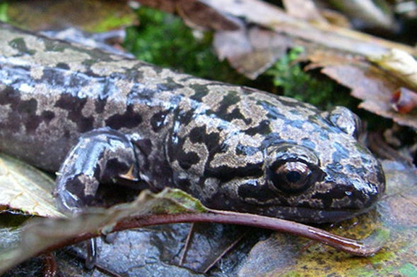

```{r setup, include=FALSE}
knitr::opts_chunk$set(echo = FALSE, message = FALSE, warning = FALSE)
```

```{r}
#attach packages
library(tidyverse)
library(janitor)
library(kableExtra)
library(ggbeeswarm)
library(here)
library(effsize)
library(ggridges)
library(knitr)
library(car)

```


Image from:https://blogs.scientificamerican.com/tetrapod-zoology/the-pacific-giant-salamanders/

### Introduction:
Pacific giant salamanders (Dicamptodon tenebrosus) typically reside in the Pacific Northwest of the United States, from San Francisco to as north as Canada. The large amphibians are mainly found in thick forests near streams, rivers, or lakes ("Pacific Giant..." 2019). These creatures are important for ecosystem health and biodiversity. With current rates of urbanization and deforestation, wildlife activists are concerned that leveling forests may have an adverse effect on biodiversity and animal health, including for the Pacific giant salamander. To determine if removing trees impacts these salamanders, this report will analyze two variables that indicate species health: abundance and weight of salamanders in Mack Creek, Oregon. By evaluating salamander abundance in both old growth and clear cut areas, as well as comparing salamander weights in cascades, side channels, and pools, this paper will determine if habitat location results in a significant difference in Pacific giant salamander population characteristics. 

### Data and Methods: 
The data for the Pacific Giant Salamanders in Mack Creek in Oregon from 1993-2017 were provided by [Aquatic Vertebrate Population Study in Mack Creek, Andrews Experimental Forest](https://doi.org/10.6073/pasta/5de64af9c11579266ef20da2ff32f702). The two location of sampling sections were in the clear cut forest and an old coniferous forest. The unit type was also recorded and classified as cascade, side channel and pool. All samples of Pacific Giant Salamanders were measured and weight (g) at each section throughout the time period. Changes in population size from 1993-2017 were based on the abundance of salamanders found each year. The association between the classification type and section type was determined by a Chi-Squared test. Salamander weight distribution (g) for 2017 was compared at the three specified classification times, including the mean and standard error. The mean salamander size for each were analyzed by a one-way ANOVA test and Tukey's test. The entire analysis was performed using R software 3.6.1. Additional information about data can be found by viewing the [metadata](https://portal.edirepository.org/nis/metadataviewer?packageid=knb-lter-and.4027.12).

### Results:


```{r}
#read in data and clean names
mack_creek <- read_csv(here::here("raw_data", "mack_creek_vertebrates.csv")) %>% 
  clean_names()
  
```

##### A. Salamander Abundance, 1993-2017
```{r}
#group Giant Pac. Sals by year and count vs section
pacific_sal_n <- mack_creek %>% 
  filter(species == "DITE") %>% 
  group_by(year) %>% 
  count(section)

og_n_93 <- pacific_sal_n %>% 
  filter(year == "1993", section == "OG") %>%
  mutate(n = as.numeric(n))

og_n_17 <- pacific_sal_n %>% 
  filter(year == "2017", section == "OG") %>%
  mutate(n = as.numeric(n))

pct_change_og <-  round(((og_n_17$n - og_n_93$n) / og_n_93$n) * 100, 1)

cc_n_93 <- pacific_sal_n %>% 
  filter(year == "1993", section == "CC") %>%
  mutate(n = as.numeric(n))
  
cc_n_17 <- pacific_sal_n %>% 
  filter(year == "2017", section == "CC") %>%
  mutate(n = as.numeric(n))

pct_change_cc <- round(((cc_n_17$n - cc_n_93$n) / cc_n_93$n) * 100, 1)
  
```

```{r}
ggplot(pacific_sal_n, aes(x = year, y = n)) +
  geom_line(aes(color = section),  show.legend = FALSE) +
   scale_color_manual(values = c("saddlebrown", "forestgreen")) +
  annotate(geom = "text", 
           x = 2000.7, y = 100, size = 3.5, fontface = 2,
           label = "Clear Cut", color = "saddlebrown") +
  annotate(geom = "text", 
           x = 1997.9, y = 190, size = 3.5, fontface = 2,
           label = "Old Growth", color = "forestgreen") +
  labs(x = "Year", 
       y = "Number of Salamanders",
       title = "Salamander Abundance in Mack Creek, 1993-2017") +
  theme_bw() +
  theme(axis.line = element_line(color = "black"), 
                    panel.border = element_blank(),
                    panel.grid.major = element_blank(),
                    panel.grid.minor = element_blank()) +
  theme(plot.title = element_text(hjust = 0.5)) +
  scale_x_continuous(expand = c(0,0), limits = c(1993, 2017)) +
  scale_y_continuous(expand = c(0,0), limits = c(50, 400)) 

```

**Figure 1.** Pacific Giant Salamander counts (individuals) in Mack Creek in old growth areas (green) and clear cut areas (brown) from 1993-2017. Abundance increased in both areas over time, with both following similar variational trends. 

From 1993-2017, Pacific Giant Salamander abundance in Mack Creek follows a similar trend in both old growth forest and clear cut areas. Overall, salamanders in both locations increased greatly in abundance during the time period, in old growth by `r pct_change_og`% and in clear cut by `r pct_change_cc`%. While salamander population increased overall, both locations experienced a sharp decline from 2011 to 2014, most likely due to an environmental stressor outside the scope of this report. After 2014, populations starting rising again. Salamander abundance was slightly higher in old growth forests also until 2014, when the trend switched and clear cur areas had slightly more salamanders.


##### B. Salamander Counts by Forest Condition and Channel Classification

**Table 1**: The number of Pacific Giant Salamanders in clear cut and old growth areas found specificially in cascade, pools, and side channels. The proportion of each location is shown as percentages.
```{r}
pacific_sal_class <- mack_creek %>%
  filter(year =="2017", species == "DITE", 
         unittype %in% c("C", "P", "SC")) %>%
  count(unittype, section)

pacific_sal_table <- pacific_sal_class %>% 
  pivot_wider(names_from = unittype, values_from = n)


pacific_sal_props <- pacific_sal_table %>% 
  adorn_percentages(denominator = "row") %>% 
  adorn_pct_formatting(digits = 1) %>% 
  adorn_ns(position = "front") %>% 
  select(-section)

  rownames(pacific_sal_props) = c("Clear Cut", "Old Growth")
  

kable(pacific_sal_props, col.names = c("Cascades", "Pools", "Side Channels"))%>% 
  kable_styling(bootstrap_options = c("striped","hover","condensed","responsive"), 
                full_width = F,
                position = "left",
                font_size = 15)
```


##### C. Chi-Square Test for Independence

```{r}
#chi-square test for measuring proportions
chi_sal <- pacific_sal_table %>% 
  select(-section)

chi_sal_test <- chisq.test(chi_sal)
```


There is no significant effect of forest condition (old growth or clear cut) on where in the channel salamanders are found (channel classification) ($\chi$^2^(`r chi_sal_test$parameter`) = `r round(chi_sal_test$statistic, 2)`, *p* = `r round(chi_sal_test$p.value, 2)`),(*p* > 0.05).**TALK ABOUT ACTUAL PROPORTIONS**


##### D. T-test for Mean Weight Differences 
```{r, include = FALSE}
sal_weight_section <- mack_creek %>% 
  select(year, species, section, weight) %>% 
  filter(year == "2017", species == "DITE") %>% 
  group_by(section) %>% 
  mutate(
    mean_weight = mean(weight)
  )

#visually exlore data for normality with
ggplot(sal_weight_section, aes(x = weight)) +
  geom_histogram() +
  facet_wrap(~section)

#explore with quantile quantile plots too
ggplot(sal_weight_section, aes(sample = weight)) +
  geom_qq() +
  facet_wrap(~section)

#they don't look normally distributed, BUT sample size is large enough that the central limit theorem applies- means are normally distributed
```


```{r}
#create vector of salamander weights for CC
sal_cc <- sal_weight_section %>% 
  filter(section == "CC") %>% 
  pull(weight)

#create vector of salamander weights for OG
sal_og <- sal_weight_section %>% 
  filter(section == "OG") %>% 
  pull(weight)

#t-test, salamander weights OG vs CC
sal_og_cc_tt <- t.test(sal_cc, sal_og)
#p > .05, no significant difference

#calculate Cohen's d
sal_og_cc_d <- cohen.d(sal_cc, sal_og, na.rm = TRUE)
#smol d, smol effect size p accurate
```

```{r}

#creating values of each of the analysis to use in text
#means
mean_cc <- mean(sal_cc)
mean_og <- mean(sal_og, na.rm = TRUE)

#standard deviation
sd_cc <- sd(sal_cc)
sd_og <- sd(sal_og, na.rm = TRUE)

#sample size
n_cc <- length(sal_cc)
n_og <- length(sal_og)

#standard error
se_cc <- sd_cc/sqrt(n_cc)
se_og <- sd_og/sqrt(n_og)

```


In 2017, the mean weights of the Pacific Giant Salamanders in clear cut forest sections (`r round(mean_cc, 2)` $\pm$ `r round(sd_cc, 2)`, n = `r n_cc`) did not differ significantly from old growth forest sections (`r round(mean_og, 2)` $\pm$ `r round(sd_og, 2)`, n = `r n_og`) by a unpaired two-sample t-test (t(`r round(sal_og_cc_tt$parameter, 2)`) = `r round(sal_og_cc_tt$statistic, 2)`, *p* > 0.005). The Cohen's d calculation (d = `r round(sal_og_cc_d$estimate, 2)`, *d* < 0.2) shows a small effect size, so our p-value is most likely accurate.


##### E. Salamander Weight Distributions by Channel Classification 

```{r}
sal_weight_class <- mack_creek %>% 
  select(year, species, unittype, weight) %>% 
  filter(year == "2017", species == "DITE", 
         unittype %in% c("C", "P", "SC")) %>% 
  group_by(unittype) %>% 
  mutate(
    mean_weight = mean(weight, na.rm = TRUE),
    sd_weight = sd(weight, na.rm = TRUE),
    se_weight = sd(weight, na.rm = TRUE)/sqrt(n())
  )

```

```{r}
#classification vectors
n_channel <- sal_weight_class %>% 
  filter(unittype == "C") %>% 
  pull(unittype)

n_side_channel <- sal_weight_class %>% 
  filter(unittype == "SC") %>% 
  pull(unittype)

n_pools <- sal_weight_class %>% 
  filter(unittype == "P") %>% 
  pull(unittype)
# counts of each classificiation to be used in in-line referencing
num_channel <- length(n_channel)
num_side_channel <- length(n_side_channel)
num_pools <- length(n_pools)
```


```{r}
ggplot(sal_weight_class, aes(x = unittype, y = weight)) +
  geom_beeswarm(size = 1, alpha = .4, 
                color = "seagreen") +
  geom_point(aes(x = unittype, y = mean_weight),
             size = 1) +
  geom_errorbar(aes(x = unittype,
                    ymin = mean_weight - se_weight,
                   ymax = mean_weight + se_weight),
                width = 0.1)+
  scale_x_discrete(labels = c("Cascades", "Pools", "Side Channels"))+
  labs(x = "Channel Classification", y = "Weight (g)", title = "Distribution of Pacific Giant Salamander Weight for Each Classification")+
  theme_minimal()+
  theme(plot.title = element_text(size = 11.5,  hjust = .5))

```

**Figure 2.** Pacific Giant Salamander's weight distribution (g) (shown in green) and mean weight (black dot) (g) found at the classifications: cascades(n = `r num_channel`), pools (n = `r num_pools`), and side channels (n = `r num_side_channel`). The black dot indicates the mean weight, while the bars show the standard error at each all three classification.


```{r, include = FALSE}
#visually explore to check for normality:
ggplot(sal_weight_class, aes(x = weight)) +
  geom_histogram() +
  facet_wrap(~unittype)

#explore with quantile quantile plots too
ggplot(sal_weight_class, aes(sample = weight)) +
  geom_qq() +
  facet_wrap(~unittype)

#they don't look normal, but central limit theorem makes our lives easy
```


```{r, include = FALSE}

#Levene test for equal variances 
leveneTest(weight ~ unittype, data = sal_weight_class)
#no significant difference in variances accross class. ANOVA is appropriate

#ANOVA 
sal_class_aov <- aov(weight ~ unittype, 
                     data = sal_weight_class)
summary(sal_class_aov)
sal_aov_outputs <- unlist(summary(sal_class_aov))

sal_aov_outputs
#we get a significant difference between at least one group
#so now we have to do post-hoc test

#tukey-test
TukeyHSD(sal_class_aov)

```

Mean weights of Pacific Giant Salamanders (g) did not differ significantly across pools (*$\mu$* = `r round(sal_weight_class$mean_weight[475],2)`g), cascades (*$\mu$* = `r round(sal_weight_class$mean_weight[16],2)`g), and side channels (*$\mu$* = `r round(sal_weight_class$mean_weight[34], 2)`g) (one-way ANOVA, F(`r sal_aov_outputs[1]`, `r sal_aov_outputs[2]`) = `r round(sal_aov_outputs[7],2)`, *p* = `r round(sal_aov_outputs[9], 3)`). Salamanders found in pools had a mean weight of `r round(((sal_weight_class$mean_weight[475] - sal_weight_class$mean_weight[16]) / sal_weight_class$mean_weight[16] * 100), 2)`% greater than those in cascades. Salamanders found in cascades had a mean weight of `r round(((sal_weight_class$mean_weight[16] - sal_weight_class$mean_weight[34]) / sal_weight_class$mean_weight[34] * 100), 2)`% greater than those in side channels. 

The post-hoc Tukey HSD test shows only a significant difference in mean salamander weights between side channels and pools (*p* < .05). Salamanders found in pools had a mean weight of `r round(((sal_weight_class$mean_weight[475] - sal_weight_class$mean_weight[34]) / sal_weight_class$mean_weight[34] * 100), 2)`% greater than those in side channels. All other combinations did not differ significantly in the Tukey HSD test (*p* > .05).

While t-tests and ANOVAs were determined to be valid tests for this data, a comparison of means may not be the most accurate way to analyze differences. The prevalence of large outliers in the weight observations by classification created positive skews that likely influenced the calculated mean weights. Therefore, a ranked test of medians may be better suited to analyze the data, as medians are not as influenced by outliers.

### Summary
- Pacific Giant Salamander abundance was comparable in both clear cut and old growth areas and increased from 1993-2017 (Figure 1).
- While the majority of salamanders were observed in cascades, there is no effect of forest condition on channel classification (Table 1).
- There is a significant difference in mean weights only between salamanders found in side channels and pools (Figure 2).


### References:
Gregory S. V. 2016. Aquatic Vertebrate Population Study in Mack Creek, Andrews Experimental Forest, 1987 to present. Environmental Data Initiative. https://doi.org/10.6073/pasta/5de64af9c11579266ef20da2ff32f702. Dataset accessed 11/25/2019.
